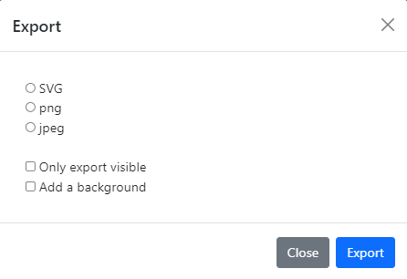
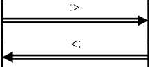
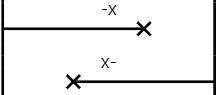
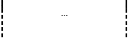
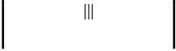
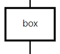
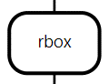

Documentation MSCGen+
=====================

1\. Introduction and Installation
----------------
### 1.1 Introduction 

An MSCgenerator is a program which is used to parse an input of MSC (Message Sequence Chart) descriptions. This input then gets parsed and generated into an SVG which forms the chart resembling the input. These charts are used for representing entities and their actions between themselves/other entities. The actions are represented by arrows and text notes, the angle of the arrows corresponds to the time it takes for the action to complete. An example would be showing how the messaging works with internet protocols.

The purpose of MSCGen+ is to add versatility to the [syntax itself](https://www.mcternan.me.uk/mscgen/) and improve on some annoyances in using the [existing editors](https://mscgen.js.org/), as a result there are a couple additions like grouping, the possibility to put certain options in a group or on the respective arc and to let these groups draw parallel to each other. Next the global width option has been removed as there is a pan and zoom which also allows for exporting the part you’ve zoomed into as well as an option to export the whole chart to an SVG or PNG. Finally, there’s also an upgrade to file sharing.

MSCGen+ works on firefox, chrome and edge. The best tested performance was on firefox for bigger inputs. As for Internet Explorer... it does not work.

### 1.2 Installation
MSCGen+ is a nginx-django server mostly written in typescript and intended to be used as a docker container
simply download the repository and compile the typescript.

Afterwards you can start the container by running  `docker-compose up` in the MSCGen folder

if you do not have docker compose installed please follow the installation instructions here: https://docs.docker.com/compose/install/

you may also want to change the secret key in /backend/Django/settings.py,
while this isn't critical for the server to function it is recommended for security reasons
 

2\. Options on the site
-----------------------

### 2.1 Pan and zoom

The window that shows the chart has a pan and zoom option. Here you can zoom in and out by scrolling and drag around by clicking and holding. If you want to reset your zoom you can click the top right button “Reset Zoom”.

### 2.2 Export

When you click on the export button this menu pops up. Here you can choose to export the chart as a svg, png or jpg. By default, it only exports your full chart, but if you tick “only export visible” it will export what you’re currently looking at in the pan and zoom window. “Add a background” adds a background to the export file.

### 2.3 Share

When you click on the share button this menu pops up. Here you can choose to either share the whole link (this link is your complete input put into a link). Or a shortened link that can handle more. If the “copy link to clipboard” option is enabled, it will copy the link straight to your clipboard so you can immediately paste it.

### 2.4 Auto render

Auto render is turned on by default, in this case input will be rendered in real-time. When it is turned off however this will not happen until it is re-enabled.

### 2.5 Help

Well the help button brings you here!

  

3\. Example
-----------

The example below shows a graph which includes all arcs and a lot of the options you can use.

The above example and all other msc inputs follow an outline of:

    Msc{
    Global options (ex: hscale = 2);
    Entity list (ex: a,b, “entity name”);
    Arc list (ex: a->b, b => “entity name”); (the arc list also contains groups if there are any)
    }

  

4\. Syntax
----------

All of the msc input is put between “msc{…}” where the full input is given between the brackets. Comments can be made if a double forward slash (“//”) is put in front of a line or if a full block needs to be commented it can be by putting it between a /\*\*/ (/\* “text to comment” \*/).

If you go more specific with an option, then it will override more global options (arc/entity options > group options > global options).

For Booleans there are a couple acceptable options for values:
*   True:
	*   1
	*   True
	*   On
	*   Yes

*   False:
	*   0
	*   False
	*   Off
	*   No

  

### 4.1 Global Options

For the global options the format is “option = value”, the value can be either between quotes (“) or without.

There is **no width** option since there is a pan and zoom implementation in mscgen+, which makes it so that zoom can be used to scale your graph and extract it according to how you zoom it.

You separate options by putting a comma between them. At the end of the option list you put a semicolon.

**Global options**
| Option name |Description|
|--|--|
| hscale | Scales the graph image by changing the width, this scales the horizontal space between entities/entity-lines according to the given float value while not changing any vertical height/distance. Hence the “h” for horizontal scale.|
|arcgradient|Sets the arrow arcs to an angle other than horizontal by giving the amount of pixels for how much further down the end of the arc needs to be compared to the start.
|wordwraparcs|Accepts a boolean value, when true this will make the text on arrow arcs wrap automatically.|
|fontsize|Takes a numeric value and changes the size of the font for all the labels to the given size.|
|autospacegroup|Accepts a boolean value, if it's true then the group spaces automatically according to the largest group that it runs parallel with. This doesn’t work in nested groups and is turned off by default.|

### 4.2 Entities

The entity format is “entity-name \[optional option list\]”. The entity-name can be a string between quotes allowing everything but unescaped quotes (“ is not allowed, so write \\” to get a quote) and it also allows “\\n” to represent a newline. The entity-name can also be one word not surrounded by quotes, where no quotes or “\\n” will be acted on.

Next there can be an optional option list where if there are options needed the name is followed by a bracket list with the options listed and separated with comma’s if there is more than one option (\[option-name = “value”,…\]).

You separate entities by putting a comma after the option list. At the end of the entities you need to put a semicolon.

**Entity options**
| Option name |Description|
|--|--|
| label| Give a string value, that accepts everything except unescaped quotes (\\”) and gives a newline on “\\n”. If there is no label option, then the entity-name is set as the label.|
|fontsize | Takes a numeric value and changes the size of the font for the label to the given size.|
|linecolour/linecolor|Sets the colour of the lining of the entity (the square around the text and the entity line under it).|
|textcolour/textcolor|Changes the colour of the text of the label.|
|textbgcolour/textbgcolor|Changes the background colour inside the square of the entity.|
|arclinecolour/arclinecolor|Sets the default colour for all arc lines(arrows and notes) that start from this entity.|
|arctextcolour/arctextcolor|Sets the default colour for all the text on the arcs(arrows and notes) that start from this entity.|
|arctextbgcolour/arctextbgcolor|Sets the default background colour for the background of the text on the arcs(arrows and notes) that start from this entity.|

  

### 4.3 Arcs

The arc format is “entity relation entity \[optional option list\]”:

*   Here the first entity is the name of the entity where the arc starts (starting entity).
*   Relation is the type of arc (arrow or note).
*   The second entity is the name of the entity where the arc ends (destination entity).
*   Finally there can be an optional option list if options are necessary. Here the second entity-name is followed by a bracket list with the options listed and separated with comma’s if there is more than one option (\[option-name = “value”,…\]).

If an arc start or goes to a “\*”(can be with or without quotes) then the arc will be drawn from the starting or to the destination entity (depending on which one isn’t a “\*”) from all entities. For an example, for the arc “a -> \*”: starting from 'a' there will be a message arc drawn to all other entities.

You separate arcs by putting a comma between them. Whenever you want to start a new row of arcs you put a semicolon, otherwise it’ll always stay on the same row. You also have to put a semicolon at the end of all your arcs.

**!Beware though if an entity has been defined then it takes precedence over other things. For example if an entity is named “\*”, then the arcs will go to that entity instead of going to all entities!**

**Arc options**

| Option name |Description|
|--|--|
|label|Give a string value, that accepts everything except unescaped quotes (\\”) and gives a newline on “\\n”. If there is no label option, you have an empty arrow/note.|
|URL|Adds a URL to the label, so when the label is clicked the page redirects to the URL.|
|ID|Adds a superscript ID identifier to the label (“label”(ID)). Can be a numerical value or a string.|
|IDURL|This combines URL and ID by making a super script ID but with the URL as the text, thus making the ID clickable redirecting to the URL. Keep in mind that an ID is needed in order to and a URL to it.|
|linecolour/linecolor|Sets the colour of the arc line for this specific arc (the arrow or the box of the note).|
|textcolour/textcolor|Changes the colour of the text of the label.|
|textbgcolour/textbgcolor|Changes the background colour of the label. (A box/note can't have a transparent background.)|
|arcskip|Offsets the vertical destination of the arc. Can be a float value and can be negative. If the destination ends up being lower than the lowest arc starting point or higher than the last arc starting point, then the destination defaults to the last arc starting point (the furthest down starting point of an arc).|
|arcgradient|Sets the arrow arcs to an angle other than horizontally by giving the amount of pixels for how much further down the end of the arc needs to be compared to the start. (Here it only affects the specific arrow that it’s added to.)|
|fontsize|Takes a numeric value and changes the size of the font for the label to the given size.|

  

**Arc types**

|Example|Arc syntax|Info|
|--|--|--|
||\-> or <-|This arrow resembles a message.|
||\=> or <=|This arrow resembles a method or function call.|
||\>> or <<|This arrow resembles a method or function return value.|
||\=>> or <<=|This arrow resembles a callback.|
||:> or <:|This arrow resembles an emphasised message.|
||\-x or x-|This arrow resembles a lost message.|
||...|Indicates a large time passed or that some signals may be omitted.|
||\---|Used to add comments to a block of signals or to indicate some action or state has occurred.|
||\|\|\||This is used to add extra space between rows.|
||box|A box is a box arc which replaces the arrow by a square box. The label is centered in the box and wrapped if necessary.|
||rbox|An rbox is a box arc which replaces the arrow by a rounded box. The label is centered in the box and wrapped if necessary.|
||abox|An abox is a box arc which replaces the arrow by a hexagonal box. The label is centered in the box and wrapped if necessary.|
||note|A note is a box arc which replaces the arrow by a note form box. The label is centered in the box and wrapped if necessary.|

  

### 4.4 Grouping

In MSCgen+ there is an option to group arcs together, this allows for multiple groups of arcs to happen at the same time with a different sequence and can be put anywhere in the input.

To group arcs together you need to put the arcs that you want to group between brackets({arcs to group}).

For each separate group you can add options that go for every arc in that group.

**Grouping options**

| Option name |Description|
|--|--|
|linecolour/linecolor|Sets the colour of the arc line for the arcs in the group (the arrow or the box of the note).|
|textcolour/textcolor|Changes the colour of the text of the label of the arcs in the group.|
|textbgcolour/textbgcolor|Changes the background colour of the label for the arcs in the group.|
|arcgradient|Sets the arrow arcs to an angle other than horizontally by giving the amount of pixels for how much further down the end of the arc needs to be compared to the start. (Here it affects all arrows in the group.)|
|fontsize|Takes a numeric value and changes the size of the font for the labels in the group to the given size.|
|autospacegroup|Accepts a boolean value, if it's true then the group spaces automatically according to the largest group that it runs parallel with. This doesn’t work in nested groups and is turned off by default.|

**Group example**

In example one you see a group with autospacegroup = false (false is the default value, so it's not explicitly declared), here you can see the group doesn’t finish at the end of the group it runs parallel with. In example two you see that the group has autospacegroup = true, here you see that it does end at the end of the group that it runs parallel with. You can see that the two groups are separated by brackets, group 1 follows the global arcgradient 10, group 2 follows the overridden group arcgradient of 30.  

**Example 1**

  

**Example 2**

  

  

5\. Colours
-----------

For the different colour options there is standard rgb support where you just need to give the RGB colour code (format: “#rgb”) but there are also a couple supported colour names, these are listed here;

**Supported colours**

|Colour strings|RGB Codes|
|--|--|
|white|#ffffffff|
|silver|#c0c0c0ff|
|gray/grey|#808080ff|
|black|#000000ff|
|maroon|#800000ff|
|red|#ff0000ff|
|orange|#ffb000ff|
|yellow|#ffff00ff|
|olive|#808000ff|
|green/lime|#00ff00ff|
|aqua|#00ffffff|
|teal|#008080ff|
|blue|#0000ffff|
|navy|#000080ff|
|indigo|#440088ff|
|purple|#800080ff|
|violet|#d02090ff|
|fuchsia|#ff00ffff|
|transparent|#00000000|
